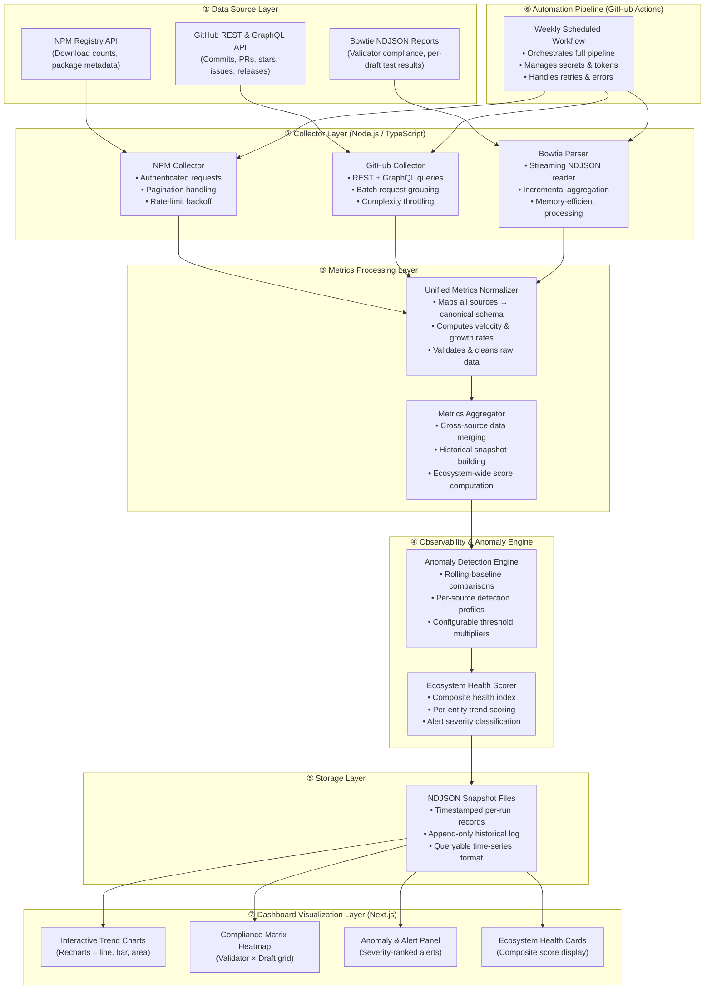

# Master Project Case Study: JSON Schema Ecosystem Observability Platform

---

## 1. Project Overview

### High-Level Description

The **JSON Schema Ecosystem Observability Platform** is a comprehensive, open-source system for monitoring, analyzing, and visualizing the health, adoption, and compliance of the JSON Schema ecosystem. It automates the collection of key metrics from NPM, GitHub, and Bowtie validator compliance reports, synthesizing them into actionable insights for maintainers, contributors, and the broader community.

### Purpose, Goals, and Impact

- **Purpose:** Provide a unified, data-driven view of the JSON Schema ecosystem’s health, adoption, and compliance.
- **Goals:**
  - Automate end-to-end data collection, normalization, anomaly detection, and dashboard visualization.
  - Enable maintainers to proactively identify regressions, stagnation, or compliance gaps.
  - Empower data-driven decision-making for ecosystem growth and quality.
- **Impact:**
  - Reduces manual reporting overhead.
  - Surfaces actionable signals for community and technical stakeholders.
  - Establishes transparent, reproducible metrics for reporting and benchmarking.

### Target Users

- Open-source maintainers
- JSON Schema contributors
- Community managers
- GSoC mentors and students
- Technical decision-makers

---

## 2. Functionalities and Features

### Core Features

- **Automated Data Collection:**
  - NPM downloads, GitHub repo activity, Bowtie validator compliance.
- **Metrics Aggregation & Normalization:**
  - Unified schema for adoption, growth, and compliance signals.
- **Anomaly Detection:**
  - Rule-based engine flags sudden drops, regressions, or stagnation.
- **Historical Tracking:**
  - Time-stamped snapshots for trend analysis.
- **Interactive Dashboard:**
  - Visualizes trends, health scores, compliance matrices, and alerts.
- **Alerting System:**
  - Severity-ranked alerts for rapid response.

### User Interaction

- Access the dashboard via web (Next.js frontend).
- Drill down into metrics by package, repo, or validator.
- Export visualizations for reports.
- Review real-time and historical alerts.

### Unique Functionality

- **Cross-ecosystem coverage:** Simultaneously tracks multiple languages and platforms.
- **Self-calibrating anomaly detection:** Uses rolling baselines for context-aware alerts.
- **Modular pipeline:** Easily extensible for new data sources or metrics.

---

## 3. Tech Stack

| Layer    | Technology                                        | Purpose/Reasoning                                |
| -------- | ------------------------------------------------- | ------------------------------------------------ |
| Frontend | Next.js, React, Tailwind CSS, Chart.js, Recharts  | Modern, interactive, and responsive dashboard UI |
| Backend  | Node.js, TypeScript                               | Robust, type-safe collectors and processors      |
| Data     | NDJSON, JSON                                      | Simple, versioned, auditable storage             |
| APIs     | GitHub REST/GraphQL, NPM Registry, Bowtie Reports | Authoritative data sources                       |
| DevOps   | GitHub Actions                                    | Automated, reproducible pipeline orchestration   |
| Tooling  | ESLint, TypeScript, ts-node, Tailwind, PostCSS    | Code quality, styling, and build tools           |

**Versions:**

- Node.js: >=18
- Next.js: 16.1.6
- React: 19.2.3
- Tailwind CSS: ^4
- Chart.js: ^4.5.1
- TypeScript: ^5
- axios: ^1.6.0

---

## 4. Architecture

### Overview

The platform is structured as a layered, modular pipeline:



#### Layered Breakdown

- **Data Source Layer:** NPM, GitHub, Bowtie
- **Collector Layer:** Modular Node.js/TypeScript collectors for each source
- **Processing Layer:** Normalization and aggregation into a canonical schema
- **Detection Layer:** Rolling baseline anomaly detection and health scoring
- **Storage Layer:** NDJSON snapshots, versioned and append-only
- **Automation Pipeline:** GitHub Actions for scheduled, reproducible runs
- **Dashboard Layer:** Next.js/React dashboard for visualization and alerts

---

## 5. File and Folder Structure

```plaintext
json-schema-ecosystem-observability/
├── visualization/            # Next.js frontend dashboard
│   ├── app/                  # App directory (pages, routes)
│   ├── components/           # Reusable React components
│   ├── docs/                 # Architecture, case study, etc. (TypeScript)
│   ├── public/               # Static assets
│   ├── package.json          # Dashboard dependencies
│   ├── tailwind.config.js    # Tailwind CSS config
│   └── ...
├── data/                     # Collected metrics and alerts (JSON)
│   ├── metrics.json
│   ├── alerts.json
│   ├── bowtie-metrics.json
│   ├── health-metrics.json
│   └── history.json
├── docs/                     # Markdown documentation (architecture, pipeline, etc.)
│   ├── architecture.md
│   ├── pipeline.md
│   ├── collectors.md
│   ├── dashboard.md
│   ├── anomaly-detection.md
│   ├── metrics-model.md
│   ├── future-work.md
│   └── ...
├── src/                      # Data pipeline source code
│   ├── collectors/           # npmCollector.ts, githubCollector.ts, bowtieCollector.ts
│   ├── utils/                # apiClient.ts, alerts.ts
│   └── index.ts              # Pipeline entrypoint
├── package.json              # Monorepo root, scripts, dependencies
├── tsconfig.json             # TypeScript config
└── ...
```

#### Major Folders/Files Explained

- **visualization/**: Next.js frontend for visualization
- **data/**: All collected and processed metrics, alerts, and historical snapshots
- **docs/**: All technical and user documentation
- **src/**: Node.js/TypeScript collectors, pipeline logic, and utilities
- **package.json**: Monorepo and workspace management

---

## 6. Data Flow

### End-to-End Flow

1. **Trigger:** Scheduled GitHub Actions workflow or manual run
2. **Collection:**
   - NPM Collector fetches downloads
   - GitHub Collector fetches repo stats
   - Bowtie Collector fetches validator compliance
3. **Normalization:** Raw data mapped to canonical schema
4. **Aggregation:** Metrics merged, health scores computed
5. **Anomaly Detection:** Rolling baseline checks for deviations
6. **Storage:** Results written to NDJSON/JSON files
7. **Dashboard:** Next.js app visualizes metrics, trends, and alerts

#### Data Model Example

```json
{
  "timestamp": "2026-03-14",
  "npmDownloads": { "ajv": 218682118 },
  "github": { "repoCount": 2420, "stars": 9143832, "forks": 1131624 },
  "bowtie": { "ajv": 97.44, ... }
}
```

---

## 7. API Calls

### Internal API Calls

- **NPM Collector:**
  - `GET https://api.npmjs.org/downloads/point/last-week/{package}`
  - Returns: `{ downloads, start, end, package }`
- **GitHub Collector:**
  - `GET https://api.github.com/search/repositories?q=topic:json-schema&per_page=100`
  - Returns: `{ total_count, items: [...] }`
- **Bowtie Collector:**
  - `GET https://bowtie.report/implementations.json`
  - `GET https://bowtie.report/draft2020-12.json` (streamed NDJSON)
  - Returns: Validator metadata and compliance results

### Dashboard Data Fetching

- Reads from static JSON files in `/data` (metrics, alerts, bowtie-metrics)
- Uses Next.js data fetching for build-time or runtime loading

### External APIs

- **NPM Registry API**
- **GitHub REST/GraphQL API**
- **Bowtie Reports**

---

## 8. Challenges and Solutions

### Major Challenges

- **API Rate Limiting:**
  - _Solution:_ Authenticated requests, exponential backoff, and batching
- **Data Normalization:**
  - _Solution:_ Canonical schema and normalization layer
- **Large Data Volumes (Bowtie):**
  - _Solution:_ Streaming NDJSON parsing, memory-efficient aggregation
- **Historical Tracking:**
  - _Solution:_ Append-only NDJSON snapshots, versioned by timestamp
- **Anomaly Detection Tuning:**
  - _Solution:_ Rolling baselines, configurable thresholds, severity classification
- **Frontend Performance:**
  - _Solution:_ Static-first dashboard, incremental static regeneration

---

## 9. Statistics and Metrics

### Metrics Collected

- **NPM Downloads:** Weekly and cumulative for 20+ packages
- **GitHub Activity:** Repo count, stars, forks, contributor activity
- **Bowtie Compliance:** Per-validator, per-draft compliance scores
- **Health Score:** Weighted composite (adoption, growth, compliance)
- **Alerts:** Anomalies, regressions, stagnation

#### Example (2026-03-14)

- **NPM Downloads (ajv):** 218,682,118
- **GitHub Repos:** 2,420
- **GitHub Stars:** 9,143,832
- **GitHub Forks:** 1,131,624
- **Bowtie Compliance (ajv):** 97.44%
- **Health Score:** 100
- **Active Alerts:** AJV downloads dropped 17.2% compared to previous run (high severity)

---

## 10. Future Improvements

- **Time-Series Database:** Move from static JSON to InfluxDB/TimescaleDB for richer analytics
- **Predictive Analytics:** ML-based forecasting for adoption and compliance trends
- **Advanced Anomaly Detection:** Integrate statistical/ML-based detection and root cause analysis
- **Custom Dashboards:** User-configurable views and filters
- **Additional Data Sources:** Stack Overflow, Discord, PyPI, Maven, etc.
- **API Service:** Public REST/GraphQL API for metrics and alerts
- **Community Feedback:** Integrated feedback and collaboration tools

---

## 11. Summary

The JSON Schema Ecosystem Observability Platform is a robust, extensible, and transparent solution for ecosystem health monitoring. By automating data collection, normalization, anomaly detection, and visualization, it empowers maintainers and the community to make informed, data-driven decisions. Its modular architecture, open data model, and extensibility ensure it will remain a vital resource as the ecosystem evolves. The platform stands as a model for open-source observability, combining technical rigor with usability and impact.

---

_This document was generated as a comprehensive, professional master case study for the JSON Schema Ecosystem Observability Platform, suitable for technical and semi-technical audiences._
