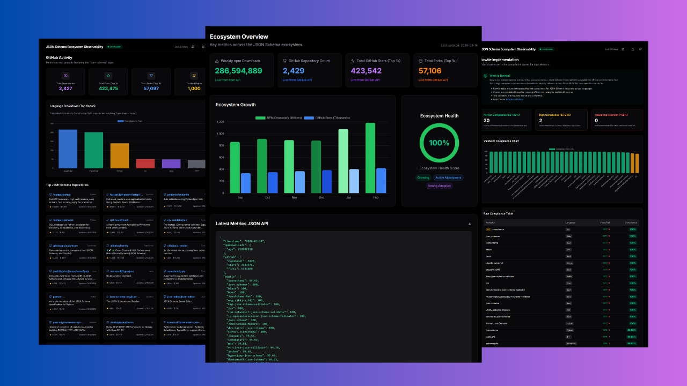

# JSON Schema Ecosystem Observability Platform | PoC

The **JSON Schema Ecosystem Observability Platform** is a **data-driven monitoring and analytics system** designed to track the health, adoption, and compliance of the JSON Schema ecosystem.

This Proof of Concept (PoC) demonstrates an **automated observability pipeline** that collects ecosystem signals from **NPM, GitHub, and Bowtie validator reports**, processes the data into unified metrics, detects anomalies, and visualizes insights through an interactive dashboard.

The platform transforms raw ecosystem data into **actionable insights**, enabling maintainers, contributors, and decision-makers to better understand the growth, stability, and compliance trends of JSON Schema implementations across the open-source landscape.



<br />

<p align="center">

  <!-- 🌍 Live Project -->
  <a href="https://json-schema-ecosystem-observability.vercel.app/" target="_blank">
    
  </a>

  <!-- 📂 GitHub Repo -->
  <a href="https://github.com/adilarain00/json-schema-ecosystem-observability" target="_blank">
    
  </a>

  <!-- 📝 Case Study -->
  <a href="https://json-schema-ecosystem-observability.vercel.app/documents/poc-case-study" target="_blank">
    
  </a>

  <!-- ✍️ Blog (Portfolio) -->
  <a href="https://json-schema-ecosystem-observability.vercel.app/documents/poc-case-study" target="_blank">
    
  </a>

  <!-- 🔗 LinkedIn Post -->
  <a href="https://www.linkedin.com/posts/adilamjad00_googlesummerofcode-gsoc2026-opensource-ugcPost-7439686845032062976-ARcM?utm_source=share&utm_medium=member_desktop&rcm=ACoAAE9gbZABjWJQao04XHSlnY-6-rfc8s4LNrc" target="_blank">
    
  </a>

</p>

---

# Tech Stack

- **🎨 Frontend:** Next.js, React, Tailwind CSS, Recharts
- **⚙️ Backend / Pipeline:** Node.js, TypeScript
- **🗄 Data Processing:** NDJSON, JSON aggregation
- **🚀 APIs:** NPM Registry API, GitHub REST & GraphQL APIs, Bowtie Reports
- **➰ Automation:** GitHub Actions
- **📊 Visualization:** Recharts charts and ecosystem health dashboards
- **🛠️ Tooling:** ESLint, ts-node, PostCSS, Tailwind

---

# Features

### 📊 Ecosystem Monitoring

- Tracks **NPM downloads** for major JSON Schema packages
- Monitors **GitHub repository growth, stars, forks, and activity**
- Aggregates **Bowtie validator compliance scores**

### 🔄 Automated Data Pipeline

- Modular **Node.js collectors** for each data source
- Automated scheduled runs via **GitHub Actions**
- Data normalization into a **unified ecosystem schema**

### 🚨 Observability & Anomaly Detection

- Rolling baseline comparison for metrics
- Detects:
  - sudden drops in downloads
  - stagnation in repository growth
  - validator compliance regressions
- Generates **alert signals for maintainers**

### 📈 Interactive Dashboard

- Visualizes ecosystem trends with charts
- Displays:
  - adoption growth
  - validator compliance
  - ecosystem health score
  - alerts and anomalies

### 🕒 Historical Tracking

- Time-stamped snapshot storage
- Enables **long-term ecosystem trend analysis**

---

# File & Folder Structure

```plaintext
json-schema-ecosystem-observability/

visualization/
├── app/                     # Next.js routes and pages
├── components/              # Reusable UI components
├── docs/                    # Case study and architecture docs
├── public/                  # Static assets
├── package.json
└── tailwind.config.js

src/
├── collectors/              # Data collectors
│   ├── npmCollector.ts
│   ├── githubCollector.ts
│   └── bowtieCollector.ts
│
├── utils/                   # Helper utilities
│   ├── apiClient.ts
│   └── alerts.ts
│
└── index.ts                 # Pipeline entry point

data/
├── metrics.json             # Aggregated ecosystem metrics
├── alerts.json              # Detected anomalies
├── bowtie-metrics.json      # Validator compliance scores
├── health-metrics.json      # Ecosystem health score
└── history.json             # Historical snapshots

docs/
├── architecture.md
├── collectors.md
├── pipeline.md
├── anomaly-detection.md
└── future-work.md

package.json
tsconfig.json
```

---

## Conclusion

The JSON Schema Ecosystem Observability Platform introduces a structured way to monitor and analyze the evolving JSON Schema ecosystem. By combining automated data collection, metrics aggregation, anomaly detection, and interactive visualization, the platform provides a transparent, data-driven perspective on ecosystem health.

This PoC demonstrates how observability concepts can be applied to open-source ecosystems, helping maintainers identify trends, detect regressions, and make informed decisions that strengthen the long-term sustainability of JSON Schema.

---

## Contact

<p align="center">
  <a href="https://aadil-amjad.me" target="_blank">
    
  </a>
  <a href="https://www.linkedin.com/in/adilamjad00" target="_blank">
    
  </a>
  <a href="https://github.com/adilarain00" target="_blank">
    
  </a>
  <a href="mailto:addilarain00@gmail.com">
    
  </a>
</p>
